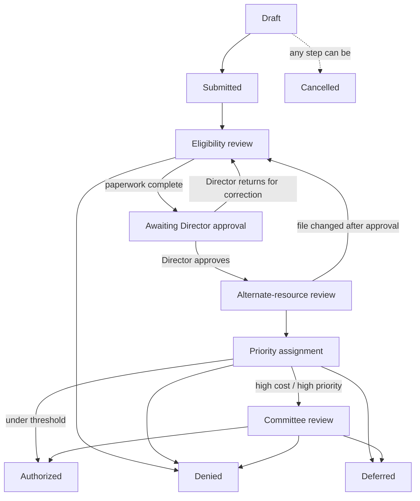

# Understanding PRC — and How Corvid Runs It

A short, plain-language guide for anyone: what Purchased/Referred Care is, how a
referral flows from request to payment, and the protections Corvid builds in. No
technical or PRC background needed.

---

## Part 1 — What is PRC?

**PRC = Purchased/Referred Care** (older name: Contract Health Services / CHS).
It's a program of the **Indian Health Service (IHS)**, run by IHS and by tribal
and urban Indian health programs.

**Why it exists.** A tribal or IHS clinic can't provide every service in-house —
it can't staff every specialist, run a hospital, or do every scan. When an
eligible American Indian/Alaska Native patient needs care the clinic can't
provide, the clinic **refers** them out, and **PRC pays the outside provider**
(the specialist, hospital, imaging center) for that care.

**The catch: the money is limited.** PRC runs on a **fixed annual budget**. It
can't pay for everything, so referrals are ranked by **medical priority** and,
when funds run short, lower-priority care is deferred. Managing that budget well
means more patients get served.

**Two hard rules shape every referral:**

- **Eligibility.** The patient must qualify — enrolled/AI-AN, living in the
  program's service area, and the care reported within required timeframes.
- **Payer of last resort.** By federal law (42 CFR 136), PRC pays **only after**
  every other coverage — Medicaid, Medicare, private insurance. Staff must check
  for "alternate resources" before PRC pays a dime.

**How it works day to day.** A clerk verifies eligibility and documents it, a
manager approves it, the program issues an authorization (a purchase order), the
outside provider delivers the care and bills, and PRC reviews and pays the
claim.

**Where it goes wrong — and why Corvid exists.** Two chronic problems:

1. **Manual, paper-heavy process → audit findings.** Files end up missing an
   application, an ID, proof of residency, or a manager's sign-off. Auditors flag
   these as "questioned costs." The single most common finding is
   **authorizations issued without documented management approval.**
2. **Overpaying outside claims.** Providers bill full charges, but the law lets
   PRC pay **Medicare-Like Rates** — often a fraction of the bill. Paying full
   charge quietly drains the budget.

Corvid attacks both: it makes the eligibility-and-approval steps impossible to
skip (fixing the audit findings), and it reprices outside claims to Medicare-Like
Rates (recovering budget). The rest of this guide is the first half — the
referral workflow and its protections.

---

## Part 2 — How a referral flows

Corvid turns the PRC process into a guided, one-way path. A referral moves
forward one step at a time, and **it cannot be authorized until the eligibility
paperwork is complete and the PRC Director has approved it.**

**The steps:**

1. **Draft** — a PRC clerk is preparing the referral.
2. **Submitted** — it's entered into the PRC queue.
3. **Eligibility review** — staff confirm enrollment, identity, residency, and
   whether other insurance should pay first; the eligibility checklist is
   completed.
4. **Awaiting management approval** — paperwork complete, waiting for the **PRC
   Director** to sign off.
5. **Alternate-resource review** — approved; confirming PRC is the last payer.
6. **Priority assignment** — the referral is ranked and checked against the
   budget.
7. **Committee review** — *only* for high-cost or high-priority referrals, which
   go to the PRC committee before approval.
8. **Authorized** — approved and set aside in the budget; the care can proceed.

Instead of authorizing, a referral can also end as **Denied** (not eligible/not
approved), **Deferred** (eligible but held, usually for funds), or **Cancelled**
(withdrawn).

**The path, at a glance:**

---

## Part 3 — What the system guarantees

These protections make PRC decisions audit-defensible — and they're enforced,
not just recommended:

1. **You can't skip steps.** A referral only moves forward in order; it can't
   jump to authorized.
2. **The Director's approval can't be skipped.** Nothing is authorized without
   the PRC Director signing off on a complete eligibility file.
3. **No approving your own work.** Whoever submitted a referral cannot approve
   it — the approver must be a different person (the Director). This is what
   stops the "no management approval" audit finding.
4. **No quiet edits after approval.** Change the eligibility file after it's
   approved and the approval is automatically voided — the referral goes back for
   re-approval.
5. **Other insurance is checked first.** Approved referrals confirm PRC is the
   last payer before money is committed.
6. **Big spend goes to committee.** High-cost or high-priority referrals go to
   the PRC committee before they can be authorized.
7. **Nothing falls through the cracks.** Denials and deferrals are explicit,
   recorded decisions — a referral is never silently dropped.

---

*For engineers: this workflow is enforced in `Corvid::PrcReferral` and specified
end-to-end in
[`features/prc/prc_referral_workflow.feature`](../features/prc/prc_referral_workflow.feature),
which runs as an automated test. One declared state, `exception_review` (for
emergency/late-notification cases), is not yet wired into this path and is
tracked separately.*
